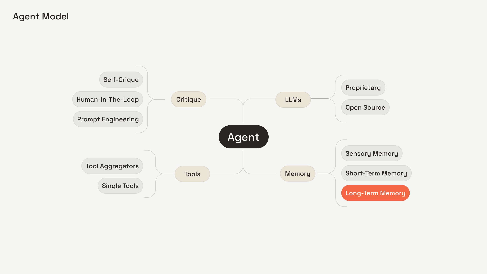

<h2>Towards an AI-Enhanced Collective Memory</h2>
The knowledge of your organisation should be instantly discoverable by any team member that needs it. <a href="https://hbr.org/1999/03/whats-your-strategy-for-managing-knowledge" target="_blank">This is not a new idea</a>¹. Capturing and storing proprietary knowledge in a searchable format has been the objective of executives for decades. <a href="https://en.wikipedia.org/wiki/History_of_wikis" target="_blank">Since at least 1994</a>² a single answer has held the monopoly of the business world knowledge problem: <em>Write Documentation</em>.

At Interloom we are convinced there are critical drawbacks to traditional documentation management. We&#x27;re enabling AI agents to capture the most important knowledge from you and your team automatically, without anyone having to endlessly create, write, update and depreciate documentation.

<strong>In other words, we&#x27;re working on <em>Collective Long-Term Memory:</em></strong> A memory system that selectively (and transparently) captures key information as it surfaces through-out the working day. It does this across all your team&#x27;s public conversations without them having to do anything except review ambiguities.
<h2>Why Documentation is tricky</h2>
Think about how much vital business information your company loses internally but also with customer communications. Consider the journey of an account in platforms like Hubspot or Salesforce, passing through various stages managed by your Business department. These teams interact with customers through emails/spreadsheets/presentations, make commitments, negotiate prices, and oversee integrations. This results in a wealth of context that, in the best-case scenario, is scattered across emails, internal chats, or knowledge management tools like Notion or Confluence.

Advancements in multimodal foundation models (FMs), such as GPT, Gemini, or Llama, have unveiled new possibilities for thorough workflow automation leveraging their broad reasoning and planning abilities. Utilizing these sophisticated models, we can now develop systems that automate the creation of documentation, seamlessly capturing and organizing knowledge from various data sources and interactions, which enhances efficiency and accuracy across business processes.

Recently, OpenAI enhanced ChatGPT by introducing memory features, which mark a significant advancement in personalization capabilities for large language models (LLM) [3]. While personalization is pivotal in B2C markets, at Interloom, our focus lies in process automation for the B2B sector, where the implementation of Collective Long-Term Memory greatly enhances business automation efficiency. To further empower this capability, we have implemented a concept of Multi Agent system designed to create a Collective Long-Term Memory, capturing data across various customer interaction platforms - internal conversations from Slack/Teams/Emails, facts from PDFs, data from CRMs, etc. - thereby ensuring that no valuable insight is overlooked.
<h2>Automating Documentation via Multi-Agent Conversation</h2><figure class="w-richtext-align-center w-richtext-figure-type-image">

</figure>
Memory is a cornerstone of any agent system, enhancing its functionality and versatility significantly. Moreover, an agent&#x27;s capabilities are defined by the tools it accesses, the large language models (LLMs) it utilizes, and its self-critique mechanisms. Typically, a single agent can operate effectively within a single domain using a limited set of tools. However, even with powerful models like GPT-4, Gemini 1.5, or Llama 400B, the scope of tasks it can handle remains restricted. To tackle more complex tasks, a &quot;divide-and-conquer&quot; strategy is employed: specialized agents are created for specific tasks or domains, and tasks are routed to the appropriate &quot;expert,&quot; as discussed in the paper <a href="https://arxiv.org/abs/2308.08155" target="_blank">AutoGen: Enabling Next-Gen LLM Applications via Multi-Agent Conversation</a> [4].

In the following demo, we would like to demonstrate a <strong>Multi-Agent Conversation</strong> that creates a Collective Long-Term Memory and automates Documentation process for your organization.
<figure style="padding-bottom:45%" class="w-richtext-align-center w-richtext-figure-type-video">
<iframe allowfullscreen="true" frameborder="0" scrolling="no" src="https://www.youtube.com/embed/sXwvo7e79L8" title="Collective Long Term Memory"></iframe>
</figure>
Through Multi-Agent Collaboration we could automatically extract company-relevant information from any interactions your business conducts with customers. It highlights the collaborative effort of multiple agents interacting and performing the task of funnelling information into a Collective Long-Term Memory, thereby enhancing the automation of documentation within your organization. Let&#x27;s detail the process step-by-step:

Through Multi-Agent Collaboration we could automatically extract company-relevant information from any interactions your business conducts with customers. It highlights the collaborative effort of multiple agents interacting and performing the task of funnelling information into a Collective Long-Term Memory, thereby enhancing the automation of documentation within your organization. Let&#x27;s detail the process step-by-step:
<ul role="list"><li><strong>Classifier →</strong> Traditional tool calling within LLMs often falls short, as outlined in the <a href="https://arxiv.org/abs/2305.15334" target="_blank">Gorilla Paper [5].</a> To address this, we employ a simple <strong>Conditional Router</strong> that determines whether to activate the memory pipeline. It has access to existing memories which are loaded using dynamic memory loading strategies (see Memory Management section).</li><li><strong>Knowledge extractor →</strong> This agent assesses a brief chat history to identify if the conversation includes details valuable for business, sales, or marketing purposes.</li><li><strong>Knowledge reviewer →</strong> This agent&#x27;s role is to compare a set of extracted knowledge against the original message history to check for any inaccuracies, a concept derived from the Reflexion paper [6]. This method prompts a large language model to assess and critique its previous responses or actions. By analyzing its past performances, the LLM can identify patterns and biases in its responses, leading to refined outcomes and a higher success rate in future interactions. This iterative process not only improves response quality but also aids in the development of more sophisticated and reliable AI systems.</li><li><strong>Action assigner →</strong> This agent determines the next steps for modifying the existing memory records from a list of extracted memories, which includes creating, updating, or deleting operations. It has access to existing memories which are loaded using dynamic memory loading strategies (see Memory Management section).</li><li><strong>Action reviewer →</strong> This agent reviews the actions made by the Action assigner and provides necessary feedback, a concept derived from the <a href="https://arxiv.org/pdf/2303.11366" target="_blank">Reflexion</a> paper [6].</li></ul>
Extracting meaningful facts from conversation threads is a complex task. The system must efficiently extract and store relevant information while maintaining design integrity. For instance, a fine-tuned GPT model can efficiently decide when to read or write to memory based on observed messages. Alternatively, small and non-expensive <strong>Classifier</strong> (i.e. GPT-3.5, Mistral-7b, Llama-3-8b) that observes the current thread of conversation and has access to existing Collective Long-Term Memory decides with (Yes/No) whether there is anything new worth saving to Memory. Then more complex <strong>Knowledge extractor</strong> model (i.e. GPT-4, Claude-3-Opus or Llama-3-400b) extracts relevant entities from the thread. Afterwards, <strong>Action assigner</strong> needs to assign an action to perform for the memory based on existing Collective Long-Term Memory: create, update or delete it [9].
<h3>Memory Management</h3>
Effective AI systems require a meticulous balance in managing the available context window through dynamic memory loading strategies. Decisions must be made regarding what information to load, when to load it, and how much memory should be offloaded, all tailored to the specific context and semantic needs of each situation.
<ul role="list"><li><strong>Prompt Storage</strong>: Critical information about the user can be directly stored within the prompt, making it readily accessible for immediate reference.</li><li><strong>Dynamic Loading of Relevant Facts</strong>: Upon receiving a new message in an ongoing thread, the system can delve into the Memory to fetch the most pertinent facts. This approach ensures that the information provided is both timely and relevant, enhancing the accuracy and utility of AI responses.</li></ul>
This strategic approach to storage and memory management ensures that AI systems not only store vast amounts of data but also utilize this information effectively, enabling smarter, context-aware interactions that drive better decision-making and user satisfaction.
<h3>Data Storage for Collective Long-Term Memory</h3>
When constructing a Collective Long-Term Memory, several storage solutions are available, each with its distinct advantages and limitations. Options range from Vector Stores (like Weaviate and Pinecone), to Key/value Stores (such as Redis and MongoDB), to Knowledge Graphs (including Neo4J and DGraph). These systems differ in how they handle data types, volumes, the number of users they support, and their execution speeds based on business needs. At Interloom, we strongly advocate for the use of Knowledge Graphs. Unlike systems that navigate via embeddings, Knowledge Graphs provide a structured way to traverse data, ensuring clearer understanding and traceable, deterministic outputs. Support for this approach is bolstered by findings from Microsoft&#x27;s recent paper, <a href="https://www.microsoft.com/en-us/research/blog/graphrag-unlocking-llm-discovery-on-narrative-private-data/" target="_blank">GraphRAG: Unlocking LLM Discovery on Narrative Private Data</a> [7] which illustrates how LLM-generated knowledge graphs significantly enhance the retrieval process in RAG systems. This improvement populates the context window with more relevant content, leads to better responses, and enables the capture of evidence provenance. Ensuring that LLM-generated results are trustworthy - factually accurate, coherent, and reflective of the original content - is crucial.
<h2>Advancing Business Efficiency Through Continuous Memory Optimization</h2>
Collective Long-Term Memory must achieve a level of accuracy where the benefits of its efficiency gains significantly outweigh the costs of correcting its errors. For instance, in our case study, achieving an accuracy rate of 80% was deemed sufficient for deploying the Memory. Establishing such success criteria typically involves methods like stakeholder interviews, financial modelling, and other enterprise planning strategies. Our system incorporates a multistage quality assurance process that includes self-validation, programmatic heuristics, and limited human intervention for error correction.

While our long-term goal is to minimize human interaction, certain critical business flow changes may still require human oversight, such as a Pull Request Review stage where changes to the Memory must be approved or declined. To manage this, an additional agent could be designated to mark points in the process where human intervention is necessary.

To continuously improve Memory Management performance, our approach includes:
<ul role="list"><li><strong>Self-Improvement</strong>: As the system repeatedly executes workflows, it monitors the outcomes of its actions. By documenting these outcomes, the system can create a repository of effective actions, which can be adapted and applied to other workflows.</li><li><strong>Model Fine-Tuning</strong>: Continually refining our model, particularly for tasks like Named Entity Recognition (NER) and selective tool invocation, ensures the system only engages memory processes when absolutely necessary. This fine-tuning enhances both the precision and responsiveness of our memory management system.</li></ul>
These strategies collectively ensure that our memory management system not only retains information efficiently but also adapts and improves over time, maximizing both operational effectiveness and data integrity.
<h2>Summary</h2>
In conclusion, Interloom&#x27;s vision of Collective Long-Term Memory represents a paradigm shift in how businesses manage and utilize knowledge. By leveraging advanced AI agents and multimodal foundation models, we streamline the documentation process, turning the unwieldy task of manual information management into an automated, dynamic, and efficient system. This transformation not only increase productivity but also enhances the decision-making capabilities within organizations by providing quick and accurate access to relevant information at all times.

As we continue to refine and expand our memory management systems, the potential for these technologies to revolutionize various sectors becomes increasingly clear. From enhancing customer interactions to optimizing internal processes, the implications of a well-implemented Collective Long-Term Memory system are profound.

We invite you to join us on this journey as we explore the endless possibilities of AI-driven documentation and knowledge management. Together, we can ensure that valuable business insights are never lost but are instead preserved, enhanced, and made accessible to empower better business outcomes.
<h2>Resources</h2>
[1] <a href="https://hbr.org/1999/03/whats-your-strategy-for-managing-knowledge" target="_blank">What&#x27;s Your Strategy for Managing Knowledge?</a>

[2] <a href="https://en.wikipedia.org/wiki/History_of_wikis" target="_blank">History of Wikis</a>

[3] <a href="https://openai.com/index/memory-and-new-controls-for-chatgpt/" target="_blank">Memory and New Controls for ChatGPT</a>

[4] <a href="https://arxiv.org/abs/2308.08155" target="_blank">AutoGen: Enabling Next-Gen LLM Applications via Multi-Agent Conversation</a>

[5] <a href="https://arxiv.org/abs/2305.15334" target="_blank">Gorilla: Large Language Model Connected with Massive APIs</a>

[6] <a href="https://arxiv.org/pdf/2303.11366" target="_blank">Reflexion: Language Agents with Verbal Reinforcement Learning</a>

[7] <a href="https://www.microsoft.com/en-us/research/blog/graphrag-unlocking-llm-discovery-on-narrative-private-data/" target="_blank">GraphRAG: Unlocking LLM Discovery on Narrative Private Data</a>

[8] <a href="https://www.youtube.com/watch?v=tSicjawrfUY" target="_blank">LangFriend: a Journal with Long-Term Memory</a>

[9] <a href="https://www.youtube.com/watch?v=oPCKB9MUP6c" target="_blank">Build an Agent with Long-Term, Personalized Memory</a>

