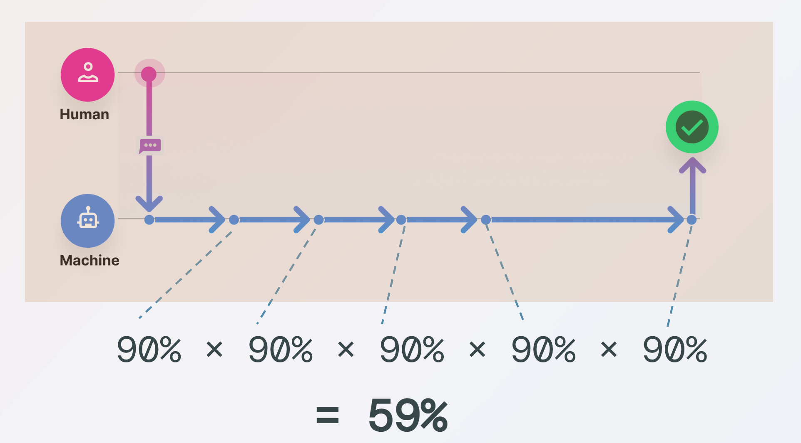
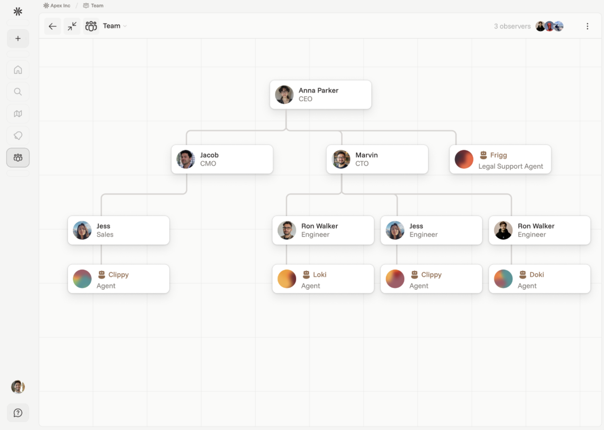

AI is everywhere. Another model breaks records, AGI is always just a few years away, and new chatbots promise to transform entire business functions. The buzz is constant, and the result is a landscape flooded with undifferentiated hype.

However, amid this changing landscape, one central question remains for leaders: <strong>Are our organizations truly designed to turn AI’s potential into real, lasting impact?</strong>

It’s tempting to think that boosting AI’s technical capabilities will automatically lead to better business outcomes. Many companies have already deployed chatbots or even AI agents. But have these implementations genuinely delivered transformative improvements in organizational efficiency? Would doubling a chatbot&#x27;s technical abilities overnight truly result in a meaningful leap in overall organizational productivity?

All too often, the answer is no or at least, not yet. <strong>The truth is, unlocking AI’s full potential isn’t just a technical challenge. It’s an organizational one.</strong>

Simply layering chatbots on top of the old workflows doesn’t produce exponential gains. And this is especially true for AI agents—autonomous programs that sense, decide, and act toward specific goals. Agents can scale infinitely as we can deploy millions at near-zero marginal cost. They operate 24/7, react in milliseconds, and coordinate with one another at a speed far beyond human capacity.

Now they’re entering organizations as digital coworkers. But the organizational theories we rely on today weren’t built for this. Today’s organizational structures were shaped over the last 150 years, designed for factories, bureaucracy, and human constraints.

And even if agents would enter, knowledge work remains fragmented—spread across meetings, emails, chats, and documents. The end-to-end workflow is unstructured, siloed, and invisible to machines and therefore inaccessible to agents.
<h3>From Capturing Corporate Knowledge to Rethinking Organizations</h3>
Transformer-based models change that. <strong>For the first time, we can process unstructured data at scale and with it, capture these previously undocumented, fragmented knowledge workflows.</strong> This alone creates massive value: organizational knowledge becomes visible, searchable, and usable.

But capturing knowledge is just the first step.

<strong>Once data is structured, agents can begin supporting the unstructured processes of knowledge workers—areas that rigid automation systems couldn’t reach.</strong>

To make this new form of human-agent collaboration effective, organizations must rethink how they operate. This includes:
<ul role="list"><li><strong>Knowledge capture –</strong> Move from static documentation to dynamic, continuous flows</li><li><strong>Workflow integration –</strong> Embed agents into everyday work, not just as surface-level add-ons</li><li><strong>Task coordination –</strong> Redefine how humans and machines share responsibility</li><li><strong>Governance –</strong> Create new rules around access, security, and oversight</li></ul>
Organizations that solve this challenge can lead the next era of productivity. And to understand the transformation ahead, it helps to look back. As Confucius said over 2,500 years ago: “To define the future, one must study the past.”
<h2>Brief History and Revolution of Automation</h2>
Before we examine how AI agents are reshaping organizations, it’s important to understand the historical relationship between humans and computers and why now is the moment to rethink how they work together.

For decades, humans and computers operated in separate domains. Computers thrived in environments with rigid structure and clearly defined rules. But as soon as a task required interpretation, adaptability, or handling of unstructured data, systems broke down. This breakdown triggered what became known as <strong>escalation</strong>: the moment a machine handed the task back to a human.

The very concept of escalation reflected this divide.
<ul role="list"><li><strong>Computers</strong> demanded structure—precise syntax, clean data, and unambiguous rules.</li><li><strong>Humans</strong> navigated ambiguity—interpreting context, resolving vagueness, and making contextual decisions.</li></ul>
Escalations were costly. They disrupted workflows and exposed the limits of automation. Organizations spent years trying to stretch automation further, hoping to reduce these interruptions. And to some extent, rule-based systems did bring gains in speed and efficiency.

But it had clear limits. Even at its peak, <strong>around 70% of knowledge work remained outside automation systems</strong>. That’s because most of this work didn’t follow rigid rules. It required judgment, context, and the ability to deal with exceptions.

A large portion of that 70% was handled using <strong>language</strong>—the most natural and flexible interface humans use. A project manager coordinating with stakeholders over Slack. A marketer shaping a narrative in a PowerPoint. These aren’t repeatable workflows. They’re evolving processes shaped by conversation, negotiation, and iteration.

The widespread adoption of tools like email, Slack, Teams, and collaborative docs isn’t an accident. It reflects the true nature of knowledge work: unstructured, dynamic, and language-driven.

Traditional automation tools couldn’t operate in this space. Once a task moved beyond a pre-set rule or defined process, the system fell away and humans had to take over entirely.

That’s the legacy we’re working with. And it’s precisely why AI agents, driven by language, context, and precedent, change everything.
<h3>The Real Transformation: Capturing Corporate Knowledge and Rethinking the Organization</h3>
The emergence of transformer-based AI models has fundamentally changed the dynamic between humans and machines. Unlike rule-based systems, these models aren’t limited to rigid inputs or narrow workflows. They operate beyond predefined boundaries—fluid, adaptive, and capable of engaging with unstructured tasks in a way that resembles human reasoning.

This unlocks the 70% of knowledge work that traditional automation couldn’t touch. Tasks once considered “edge cases”, driven by judgment, language, and ambiguity, can now be tracked, captured, and supported in real time.

That alone is a breakthrough. <strong>Tacit knowledge, once trapped in the heads of individual employees, becomes visible, shareable, and resilient—even when people leave.</strong>

<strong>More importantly, capturing this knowledge gives AI agents the grounding they need to act effectively.</strong> With tools like vector embeddings, process traces, and adaptive knowledge graphs, organizations can surface the hidden know-how embedded in daily work.

Agents no longer follow fixed routines. They gain context. They learn from precedent. They integrate into workflows as dynamic participants—automating when possible, adapting when needed, and continuously evolving with the team.

<strong>Dynamic coordination</strong> between humans and agents is no longer a concept—it’s now practical.

The shift from rigid automation to adaptive AI reshapes the nature of work itself. AI agents, now capable of learning, interpreting context, and handling unstructured tasks, are no longer just tools. They are digital coworkers - active participants within the organization.

Their integration compels us to look beyond the technology itself and re-examine the <strong>very foundations of <em>why</em> organizations exist and <em>how</em> they achieve efficiency</strong>. To understand the scale of transformation AI agents represent, we must first revisit these fundamental principles.

And by building systems and software that actively support this, rather than retrofitting old models, we can create truly AI-native organizations. Organizations that:
<ul role="list"><li>Capture and distribute tacit knowledge</li><li>Embed agents directly in core workflows</li><li>Support flexible, real-time coordination</li><li>Rethink leadership for a hybrid human-machine environment</li></ul>
That’s the path to true AI-native organizations. Not companies that <em>use</em> AI—but companies <em>built</em> for it.

That’s where the real &gt;10x productivity gains will come from—not just smarter tools, but a smarter structure and software to match.
<h2>Why Do Organizations Exist?</h2>
Organizations exist to help individuals achieve common goals more effectively than they could working alone.

This principle is ancient. Early humans formed hunter-gatherer bands for exactly this reason. By organizing into groups, they could hunt large prey, share resources during scarcity, and pass down essential knowledge across generations.

The economic rationale came later. In 1937, economist Ronald Coase formalized the idea that organizations reduce <em>transaction costs</em>—the friction of market-based coordination. But the need to organize runs deeper than economics. It’s rooted in human nature. We form groups instinctively—not just to survive, but to thrive. Cooperation, not competition, has often been the engine of human progress. Some have called this <em>“the survival of the friendliest.”</em>

Whether viewed through the lens of efficiency or evolution, the advantages of organizing emerge through a few foundational mechanisms. Three stand out in particular—both in how organizations operate today and in how AI will reshape them:
<ul role="list"><li><strong>Specialization (Division of Labor)</strong></li><li><strong>Coordination</strong> and <strong>Leadership</strong></li><li><strong>Standardization</strong></li></ul>
These pillars have long defined organizational success. But each one is now being challenged and reimagined—by the arrival of AI agents.
<h2>1 - Specialization</h2>
From the earliest human societies to modern enterprises, people have always focused on what they do best to maximize collective output. This principle has shaped every era of progress:
<ul role="list"><li><strong>Ancient Egypt:</strong> pyramids built through distinct roles—architects, laborers, engineers</li><li><strong>Roman Empire:</strong> military units structured by rank—centurions, tribunes, prefects</li><li><strong>Middle Ages:</strong> guilds formed around trades—blacksmiths, weavers, cobblers</li><li><strong>Industrial Revolution:</strong> factories optimized production through assembly lines</li><li><strong>Today:</strong> organizations rely on specialized functions—managers, analysts, engineers, marketers</li></ul>
Every organization relies on this idea: specialization leads to greater overall efficiency and it is rooted in basic math and the power of relative strength of each part.

With AI agents entering organizations, specialization doesn’t disappear, on the contrary, it becomes more important than ever. Why? <strong>Because the <em>efficiency gap</em> between potential task performers has exploded.</strong>
<ul role="list"><li>In <strong>human teams</strong>, the difference between experts and average performers might be 2x.</li><li>With <strong>AI agents</strong>, the gap can be 10x, 50x, or even 100x—for tasks like summarizing documents, parsing data, or generating code.</li></ul>
This radically shifts the way we think about division of labor. The key for AI-native organizations isn’t just using AI agents—it’s <strong>ensuring the right AI agents are assigned to the right tasks</strong> at all times. Misallocating tasks now results in huge opportunity costs for businesses, or formulated positively - organizations that achieve this will be able to experience exponential productivity gains.
<h3>Agent-First Is a Myth—Orchestration Is the Reality</h3>
AI agents are powerful, but they’re not infallible. Depending on the task, they can make critical errors—caused by missing training data, hallucinations, or lack of real-time context. While large language models may outperform humans by 100x in some areas, they lag far behind even children in others, such as perceptual judgment or basic common sense.

This variability matters. An agent that operates at only 50% accuracy creates a <strong><em>trust gap</em></strong>. Knowledge workers can’t rely on it. Instead of saving time, they’re forced to constantly verify outputs—shifting from doing meaningful work to checking flawed results. The agent becomes an overhead, not an accelerator.

Accuracy has cascading consequences. Most business processes aren’t standalone tasks—they’re chains of interdependent subtasks. Even an agent that performs with 90% accuracy per task might not be reliable enough when seen across a full process.

Consider a 5-step workflow:
<ul role="list"><li>If each step has 90% accuracy, the overall workflow accuracy becomes <strong>0.9⁵ = 59%</strong></li></ul><figure class="w-richtext-align-center w-richtext-figure-type-image">

</figure>
In other words, nearly half the time, the end result will be wrong. Not because the agent is inherently weak but because real-world systems don’t tolerate compounded errors well.

This reinforces a critical truth: <em>fully autonomous, end-to-end processes are rare in real-world settings</em>. Everything begins and ends with the human. AI can transform workflows, but human oversight, input, and judgment remain essential—especially at the boundaries of systems and in high-leverage decisions.

So, what’s the path forward?
<ul role="list"><li>Use agents <strong>only where performance is proven</strong>—measured in speed, cost, and accuracy</li><li>Keep humans in the loop where oversight is critical</li><li>Rethink workflows around <strong>orchestration</strong>, not blind automation</li></ul>
<strong>The future isn’t agent-first. It’s task-first.</strong> It’s about orchestrating the right actor (human or agent)for the right task at the right time.
<h3>Specialization Demands Coordination</h3>
A few core insights stand out:
<ul role="list"><li><strong>Humans and AI agents should be assigned tasks where they hold a clear comparative advantage</strong>—considering speed, accuracy, or cost.</li><li>Delegating entire end-to-end workflows to agents without assessing subtask-level performance is insufficient. Agents rarely outperform humans at <em>every</em> step and from a responsibility perspective, full automation is often undesirable.</li><li>Instead, organizations must adopt a <strong>granular and dynamic task allocation strategy</strong>, evaluating each subtask individually.</li></ul>
This reframes how we understand the relationship between the two foundational levers of organizational efficiency:
<ul role="list"><li><strong>Specialization</strong>—Assign the right performer (human or agent) to the right task</li><li><strong>Coordination</strong>—Ensure they work together seamlessly across workflows</li></ul>
When agents are only given tasks where they truly excel—supported by the right tools, models, and configuration—organizations are naturally pushed to integrate them within human workflows.

And this integration demands <strong>dynamic coordination</strong> (real-time orchestration).

Agents aren’t isolated executors. Their outputs shape what happens next, often involving human judgment. Likewise, human inputs often serve as prompts or constraints for agent actions. The back-and-forth is fluid.

That’s why <strong>real-time orchestration</strong> becomes essential. Not static handoffs or siloed interactions through chat interfaces. But live, adaptive collaboration, where task assignment shifts based on context, confidence, and comparative strengths.
<h2>2 - Coordination</h2>
The importance of coordination is not new—at least when it comes to humans. As far back as 1947, James Mooney wrote in <em>The Principles of Organization</em> that every organization depends on “the clear, orderly arrangement of specialized efforts so that each part contributes effectively to a common goal.” Coordination, he argued, isn’t a nice-to-have. It’s a foundational requirement for real efficiency.

The logic is simple: <strong>Specialization creates dependency</strong> and that dependency demands coordination.

This principle becomes even more critical with the arrival of AI agents. When the comparative advantage of certain parts increases by factors of 10x, 50x, or even 100x, the <strong>value of effective coordination increases exponentially</strong>.

But that’s also where the challenge intensifies.

Coordination between humans and agents isn’t just more important—it’s more complex.
<ul role="list"><li>Business workflows consist of dozens or even hundreds of interlinked subtasks</li><li>Across an organization, there may be thousands of such workflows operating simultaneously</li><li>Each subtask now requires a decision: <strong>Who should do this?</strong> A human? An agent? If an agent, which one? With what model, tools, and context?</li></ul>
This decision isn’t static. It depends on task type, required accuracy, current context, data availability, and resource cost. What was optimal a day ago might not be now. The <strong>coordination layer itself becomes dynamic and recursive</strong>—a continuous optimization problem.

Without the right infrastructure for this orchestration—<strong>tools that can manage real-time task assignment, monitor performance, and adjust configurations on the fly</strong>—organizations risk drowning in complexity. Even with state-of-the-art AI, the absence of strong coordination turns potential into friction.
<h3>Dynamic Coordination Is the New Competitive Advantage</h3>
Solving the coordination challenge starts with capturing the 70% of work that traditional automation could never reach. Unlike past systems limited to structured workflows, modern AI—especially transformer-based models—makes it possible to surface and structure even unstructured, tacit knowledge.

In combination with the 30% of processes already well-structured, this creates a path toward <em>entire workflow visibility</em>. Using tools like vector embeddings, process traces, and adaptive knowledge graphs, organizations can now map operational knowledge embedded in everyday work across functions and teams.

This visibility enables a powerful second step: intelligent task orchestration.

For every step in a workflow, organizations can now analyze:
<ul role="list"><li><strong>Should an agent provide support?</strong></li><li><strong>What kind of support makes sense?</strong> Based on speed, accuracy, and cost</li><li><strong>How should the agent be configured?</strong> Model choice, context, tools, and parameters—all tuned using historical data, current task context, and required accuracy</li></ul>
The result is a system that dynamically coordinates work across humans and agents. Not as a rigid automation pipeline, but as a responsive, adaptive framework.

Agents are no longer limited to pre-programmed routines. With this structure in place, they gain a blueprint to embed themselves directly into workflows:
<ul role="list"><li>Automating where appropriate (and if wanted)</li><li>Adapting in real time to the current context</li><li>Learning from historical outcomes</li><li>Acting as true extensions of the team</li></ul>
This transforms the theory of dynamic human-agent collaboration into a practical reality.

By applying the up to <strong>100x specialization advantage</strong> of agents <em>precisely where it delivers value</em> and keeping complex decision-making and critical judgment in human hands—organizations can optimize for both efficiency and control.
<h2>Leadership</h2>
At the same time, this prompts the question of leadership.

Once deployed, agents can be auto-assigned work. But delegation is just one piece of management. Real leadership includes:
<ul role="list"><li>Defining the agent’s role, scope, and responsibilities</li><li>Setting performance metrics</li><li>Monitoring critical outputs</li><li>Giving feedback and adjusting behavior</li><li>Approving decisions when necessary</li><li>Defining governance and access controls</li><li>Ensuring alignment with company policies and standards</li></ul>
While IT may manage the underlying infrastructure, and a central AI team can provide tools, templates, and guidance, <strong>day-to-day oversight is an operational function</strong>—not a technical one.

The answer isn’t to centralize control under an AI department or wait for AGI to manage itself.

<strong>The real leaders of AI agents are today’s functional managers.</strong>

These are the people already defining goals, running teams, and making judgment calls. They know the work. They understand priorities. And crucially, they already lead through language—making them ideally positioned to manage agents using the same methods they use to manage people.

Just like onboarding a new team member, a manager can:
<ul role="list"><li>Instruct the agent</li><li>Offer real-time feedback</li><li>Adjust responsibilities</li><li>Evaluate outcomes</li></ul>
No IT ticket. No wait time. The agent responds, learns, and adapts—just like a junior employee would.
<h3>Embedding Agents Into the Organizational Chart</h3>
This approach calls for a simple but important structural shift: <strong>the organizational chart must evolve</strong>. Agents should appear in it—not as outsiders, but as recognized, integrated parts of the team.
<figure class="w-richtext-align-center w-richtext-figure-type-image">

</figure>
Doing so helps clarify core operational questions:
<ul role="list"><li><strong>Who is responsible for the agent’s performance?</strong></li><li><strong>What systems and data should the agent access?</strong></li><li><strong>What guardrails should govern its actions?</strong></li></ul>
Just like human employees, agents must follow role-based access. For instance:
<ul role="list"><li>An employee without access to payroll data shouldn’t be able to deploy an agent that can view or act on that data.</li><li>Similarly, an agent with privileged access shouldn’t produce outputs that leak restricted information to others.</li></ul>
At small scale, this may seem manageable. But as agent usage grows across departments and teams, only a structured model of ownership and oversight can scale effectively.

By embedding agents into the org chart—complete with reporting lines, access rights, and accountability—makes the problem solvable at scale.

This isn’t just about software. It’s about leadership. And it starts with giving managers the authority and tools to lead a new kind of teammate.
<h2>3 - Standardization</h2>
Having explored specialization and coordination, we arrive at the third pillar of organizational efficiency: <strong>standardization</strong>.

Whenever processes repeat, standardization eliminates the need to reinvent solutions. It provides consistency, scalability, and reliability—especially vital in large, complex organizations.

A historical example illustrates this well: the Roman <em>testudo</em> (“turtle”) formation. Soldiers used identical shields designed to lock together, forming a seamless wall of defense. The formation required no customization—just adherence to shared design and timing. The result: precision coordination under pressure.

Modern research reinforces this value. Studies by Inkson et al. (1970) and Child (1972b) show that standardized processes help organizations manage complexity, reduce ambiguity, and deliver consistent outcomes—especially at scale.

This idea was taken to its extremes during the Industrial Revolution, where efficiency was achieved by breaking work into repeatable, mechanical tasks. Uniformity drove output but often at the cost of adaptability and innovation.

Later, the same thinking was applied to knowledge work through <strong>Standard Operating Procedures (SOPs)</strong>. These offered some structure in otherwise unstructured environments. But their limits soon became clear.

Most real knowledge work doesn’t follow scripts. It spans dynamic contexts, evolving goals, and fluid collaboration. While useful in narrow, well-defined scenarios, SOPs inherit the same limitations as rigid automation. They become outdated quickly and often constrain two critical drivers of long-term success: flexibility and creativity.
<h3>So Is Standardization Still Necessary?</h3>
The answer is yes—but not in the way it used to be. Roughly <strong>30% of workplace tasks</strong> follow fixed, repeatable patterns. These tasks are ideal for traditional automation. They&#x27;ve been standardized, optimized, and executed with near-perfect reliability. There’s little reason to reinvent what already works.

But the remaining <strong>70%</strong>—the work that resists scripts and rigid workflows—is a different story. These are the tasks shaped by nuance, evolving context, and human judgment. Historically, they’ve been too complex for software to handle.

That’s no longer the case.

Modern AI systems can interpret language, grasp context, and learn from precedent. This enables a <strong>new kind of standardization</strong>—one that’s adaptive and context-aware.

At first glance, that may sound like a contradiction. But it actually mirrors how experienced knowledge workers operate. When faced with a new task, humans don’t reinvent the wheel. They draw from memory, training, and previous examples. They recognize patterns, identify exceptions, and adjust.

That’s still standardization—just not based on rigid rules. It’s flexible, living, and grounded in precedent.

Now, for the first time, software can behave the same way. <strong>AI agents can learn from organizational traces</strong>—emails, chats, documents, SOPs, ERP logs and more powerfully, <strong>through direct interaction and feedback</strong>. With access to this knowledge, they can:
<ul role="list"><li>Automate tasks that follow recognizable patterns</li><li>Adapt when exceptions arise</li><li>Improve over time through usage and refinement</li></ul>
In this model, <strong>documented human precedent <em>becomes</em> automation</strong>. By capturing and structuring organizational knowledge, companies create the foundation for agents to act with purpose, precision, and awareness. They’re no longer executing blindly—they’re operating from the same base of experience that human experts use.

Most agent tasks will be repetitive, and over time, naturally standardized. But when the unexpected happens, agents won’t break, they’ll adapt. That’s the shift.

This also explains why <strong>functional managers, not AI specialists, are best positioned to lead this change</strong>. They already know how to onboard, guide, and manage human workers. Now, they can apply the same principles to managing AI agents.

The technology is here. The people to run it are already in place.

The companies that move early—those who begin <strong>capturing and structuring their knowledge now</strong>—will unlock the full value of agent specialization where it counts. They’ll gain speed, precision, and cost advantage, while keeping strategic control in human hands.

The result?

<strong>A sharper divide between the winners and everyone else.</strong>

