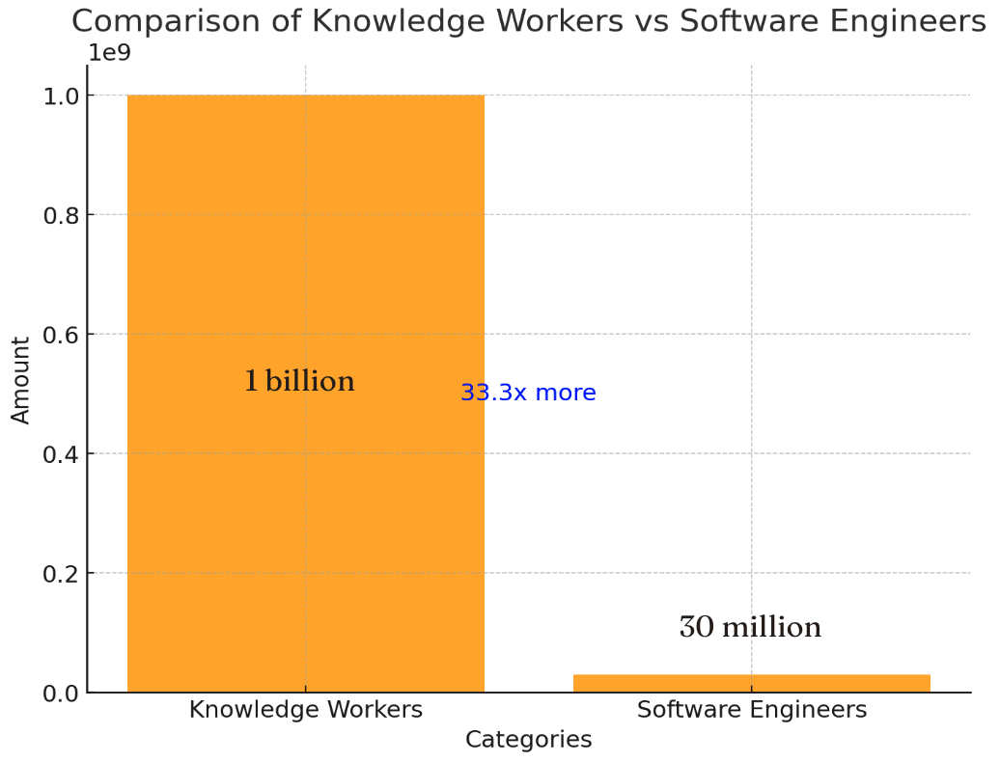
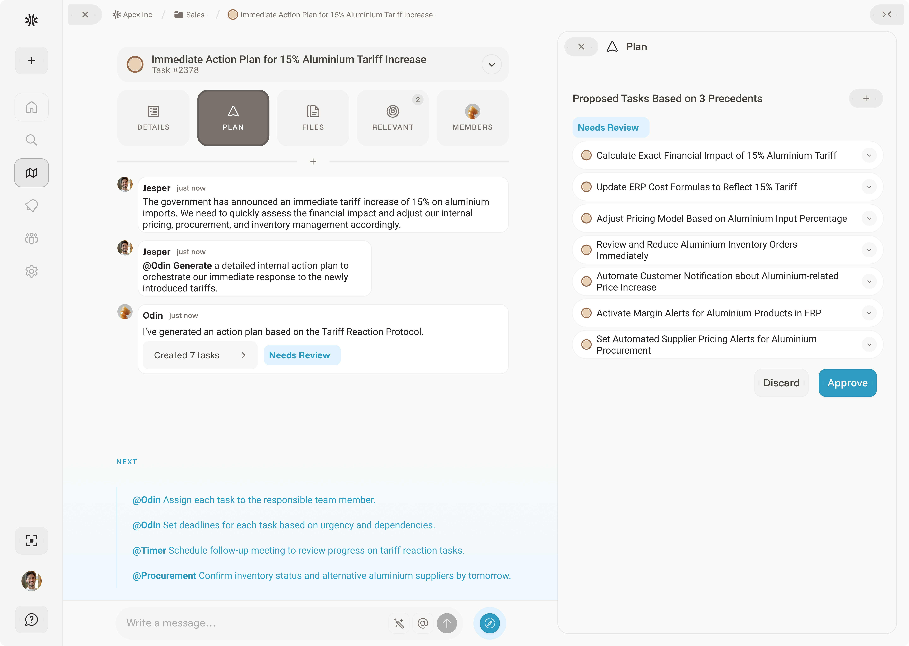

<h3>The New Global Dynamic</h3>
Global disruptions have always been a reality for businesses, but today&#x27;s leaders face them with increasing frequency and intensity. Export controls, new tariffs, ongoing conflicts causing supply-chain disruptions, COVID-19, and Brexit are all prominent examples highlighting this new reality.

Such external events originate beyond a company’s control, yet they demand <strong>immediate and strategic internal responses.</strong> Organizational flexibility is no longer a competitive advantage. It’s mandatory.

This principle isn&#x27;t new. As far back as the late 1950s, organizational theorists Tom Burns and G.M. Stalker distinguished between two models: <strong>mechanistic organizations</strong>, optimized for stability and control, and <strong>organic organizations</strong>, designed for flexibility and responsiveness.

In stable environments, mechanistic structures perform well. Centralized decision-making, standardized policies, and predictable processes create efficiency. But in dynamic conditions - characterized by rapid change and uncertainty - <strong>such rigidity becomes a liability.</strong> It delays responses, limits adaptability, and can ultimately threaten the survival of the business.
<h3>Operational Teams as the Glue</h3>
So when disruption strikes, businesses must respond immediately. Traditional software development is not equipped for this pace. With development cycles often spanning longer than 6 months, the delivered solution may already be outdated by the time it launches.

Take international tariffs, for example. By the time a solution is scoped, developed, and deployed, the business environment may have already shifted again. The window for impact is gone. This is why teams often don’t even attempt to adapt their systems. They know the effort won’t pay off in time.

As a result, <strong>operations teams are forced to rely on people – operational teams – as the only flexible response mechanism</strong>.

They step in to bridge the gaps using email threads, ticketing systems, spreadsheets, manual workflows and static manual documentation.

They act as <strong>improvised infrastructure</strong>, keeping operations running despite systemic misalignment. In practice, they serve as the &quot;duct tape&quot; holding fragmented processes together.

While this is visible in large, high-stakes shifts, it’s just as present in the day-to-day. After go-live, a constant stream of small, evolving needs begins to surface – pricing adjustments, process exceptions, customer-specific variations. <strong>Traditional software simply can’t keep up. These changes are too fluid, too uncertain, and often too minor to justify a formal development cycle.</strong>

The result: As a result, operational teams are left to manage much of this real-world complexity and documentation manually. No interfaces. Minimal tooling.
<h3>The Rigidity of Traditional Software</h3>
At the heart of the issue - and why knowledge workers ultimately have to step in - is a fundamental mismatch:
<ul role="list"><li><strong>Software requires precision, structure, and logic</strong></li><li><strong>But business reality is fluid, messy, and unpredictable</strong></li></ul>
<strong>Bridging this gap requires translation</strong> – a process often mediated by consultants, long implementation cycles, and extensive coordination.

Reality needs to be defined into business requirements which need to be translated into technical specifications. At the same time, all of these specifications must align with existing systems, workflows, and constraints.

This adds complexity. The result is a fragile process with countless dependencies. It&#x27;s slow by design, costly to conduct, and uncertain in terms of ROI.
<h3>The Shift: Language-Based Programming Empowers the Operational Teams</h3>
This is exactly where software that adequately leverages the potential of artificial intelligence marks a fundamental shift in business responsiveness.

It introduces a radically more flexible way to adapt software - using language.

Operational teams can now make small changes themselves by giving direct instructions in natural language to intelligent agents that operate on top of the existing infrastructure.

Software adaptability is no longer limited to the world’s 30 million software engineers. It now extends to over a billion knowledge workers – all of whom speak a natural language.
<figure class="w-richtext-align-center w-richtext-figure-type-image">

</figure>
With that they can now cover a big part of what’s needed to adapt to sudden changes. <strong>With 5% of the work they can often achieve &gt;50% of the solution</strong> - fast.

<strong>For example, as a response to sudden tariffs the different operation leads might type:</strong>
<ul role="list"><li><strong>Finance:</strong> &quot;Modify existing forecasting templates to automatically reflect a 15% cost increase in aluminum imports.&quot;</li><li><strong>Compliance:</strong> &quot;Automatically flag affected HS codes in the product catalog based on recent U.S. tariff changes and generate compliance summary reports.&quot;</li><li><strong>Sales:</strong> &quot;Implement customizable email templates within CRM that automatically adjust pricing communications based on region-specific tariff impacts.&quot;</li><li><strong>Procurement:</strong> &quot;Enhance supplier database queries to identify and rank alternative suppliers to Chinese steel, meeting lead times under four weeks.&quot;</li><li><strong>Operations:</strong> &quot;Automatically cross-reference Bill of Materials (BOMs) to identify tariff-affected components and propose pre-approved alternative materials.&quot;</li></ul>
By empowering operational teams to directly manage the dynamic complexities of daily operations, businesses reduce the reliance on consultants, product managers, and engineers. <strong>This ensures issues are addressed precisely where expertise is highest, as operational teams inherently understand their needs the best.</strong> The result is not only improved solution quality but also significantly shorter iteration cycles.

Organizations can therefore respond effectively within hours, managing real-world dynamics with genuinely real-time tools.

<strong>Simultaneously, product and IT teams are freed</strong> to focus on building robust foundational platforms, comprehensive integrations, and scalable automation workflows. They spend less time managing multiple custom implementations, thus reducing backlog accumulation.
<h3>Why This Needs a Horizontal Platform</h3><figure class="w-richtext-align-center w-richtext-figure-type-image">

</figure>
To support this shift, it takes a horizontal platform – one that works across departments and functions.

This is where traditional software often cannot support. Most tools are built for <strong>vertical, high-volume processes</strong>: invoicing, payroll, logistics. They work well for standardized, repeatable tasks that do not change a lot. And that’s fine – for those processes, they’ll continue to work and with AI agents built on top of these systems some of the additional edge-cases can be captured.

But the opportunity to reach a new level of efficiency now lies in the remaining 70% of operational work of which a large part is cross-departamental – <strong>where change is constant. This segment represents the hidden long-tail of tasks that are typically costly, manual, and inelastic.</strong> These include:
<ul role="list"><li>Escalations across all departments</li><li>Cross-departmental workflows that require seamless coordination</li><li>One-off or unique situations that do not justify custom-built solutions</li></ul>
These areas are precisely where knowledge workers currently step in to fill gaps. Interloom is specifically designed to support these critical, yet underserved operational tasks, enabling businesses to effectively handle complexity and variability.

It empowers operational teams to act swiftly without direct reliance on central IT.

But it does this within a <strong>controlled environment</strong>. It is not enabling thousands of employees to build core infrastructure. That remains the job of the IT department.

Instead, Interloom provides a <strong>dedicated layer for expert operational teams</strong> – a safe, abstracted workspace that supports them.

By managing agents through natural language alone, Interloom unlocks the potential for millions of specialists to independently resolve issues, significantly enhancing organizational agility.

